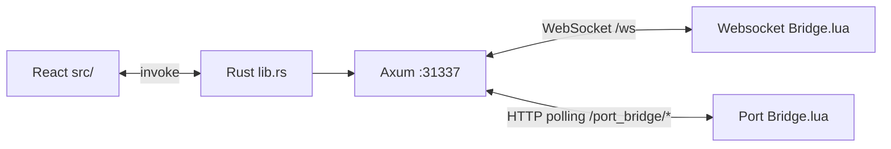

# Synapse Framework

Synapse is an advanced, multi-shell script execution environment for Roblox. It features a powerful Monaco-based editor, a seamless WebSocket bridge for cross-game persistence, and iconic UI themes (Synapse Blue, Synapse Original 2017, Synapse X, V3) for a fast, customizable scripting experience.

> **Note on V3:** V3 is enabled in settings but still in progress — UI and executor integration may be incomplete.

## Documentation

| Doc | Description |
|-----|-------------|
| [docs/PROJECT_OVERVIEW.md](docs/PROJECT_OVERVIEW.md) | Architecture, routes, IPC, shells, and key file map |
| [docs/WEBSOCKET_BRIDGE.md](docs/WEBSOCKET_BRIDGE.md) | Executor bridges — WebSocket (`/ws`) and Port Bridge (`/port_bridge/*`), settings, protocol, Lua clients |
| [docs/SOURCE_DISTRIBUTION.md](docs/SOURCE_DISTRIBUTION.md) | Small source archives, `ui-export/`, verify/pack scripts |

## Workspace size (read this first)

A full dev folder is often **2+ GiB on disk** — that is normal while you build, but it is **not** the size of the source tree.

| Path | Typical size | What it is |
|------|--------------|------------|
| `src-tauri/target/` | ~2 GiB | Rust compile output — `npm run tauri:build` |
| `node_modules/` | ~200 MiB | npm packages — `npm install` |
| `dist/` | ~20 MiB | Vite production bundle — `npm run build` |
| `ui-export/` | ~8 MiB | UI porting snapshot — `npm run export:ui` |

**Tracked source** (`src/`, `src-tauri/` without `target/`, configs, docs) is about **5–10 MiB**.

**Delete local build artifacts** (nothing in `src/` is removed):

```bash
npm run clean
```

Preview first: `npm run clean:dry`. After cleaning, reinstall when you need to build again: `npm install`, then `npm run build` or `npm run tauri:build`.

**Sharing source** — do not zip the whole folder. Use `npm run source:pack` (~11–15 MiB). See [docs/SOURCE_DISTRIBUTION.md](docs/SOURCE_DISTRIBUTION.md).

---

## Building from Source

### Prerequisites

- **Node.js** 18 or newer
- **Rust** — install via [rustup.rs](https://rustup.rs/) (stable toolchain)
- **Visual Studio Build Tools 2022** with the **Desktop development with C++** workload (provides `link.exe` for the Rust/Tauri backend on Windows)
- **WebView2** — usually already installed on Windows 11; required for the Tauri webview

### Install dependencies

```bash
npm install
```

### Development

**Desktop app (recommended):**

Run from a **Visual Studio–enabled** shell so the Rust toolchain can link:

- Open **x64 Native Tools Command Prompt for VS 2022**, or
- Run `VsDevCmd.bat -arch=amd64 -host_arch=amd64` in your terminal, then:

```bash
npm run tauri:dev
```

The first run compiles the Rust backend and may take several minutes.

> **Note:** `package.json` may hardcode a local path to `VsDevCmd.bat`. If `tauri:dev` fails to find the linker, run the commands above from a VS Native Tools prompt instead, or update the `tauri:dev` / `tauri:build` script paths for your machine.

**Browser-only UI** (no native shell):

```bash
npm run dev
```

Then open `http://127.0.0.1:5173`. For full Tauri features (window controls, filesystem, bridge), use `tauri:dev` instead.

### Production build

**Frontend only:**

```bash
npm run build
```

Output: `dist/`

**Windows MSI installer:**

1. Close any running instance (otherwise the linker may fail because `app.exe` is locked):

   ```powershell
   taskkill /IM app.exe /F 2>$null
   ```

2. From a **VS-enabled** shell (see Development above), run:

   ```bash
   npm run tauri:build
   ```

   This runs `export:ui` then `vite build` before the Rust bundle (`build:release`). For installer **and** a small source zip in one step:

   ```bash
   npm run release
   ```

3. Installer output:

   ```
   src-tauri/target/release/bundle/msi/Synapse Framework_0.1.0_x64_en-US.msi
   ```

The first release build also compiles all Rust dependencies and can take several minutes.

### Small source distribution

The canonical build tree is `src/` + `src-tauri/` + root config files. To check nothing required is missing:

```bash
npm run source:verify
```

After `npm install`, verify the frontend build:

```bash
npm run source:verify:build
```

**Do not zip the whole project folder.** On disk it is often **2+ GiB** because of `src-tauri/target/` and `node_modules/`. Those are not source — they are rebuilt after extract.

Check what is using space:

```bash
npm run source:measure
```

Create a small shareable zip (**~8–15 MiB**, include-only from `source.manifest.json`):

```bash
npm run source:pack
```

Output: `synapse-source-small.zip` (~15 MiB, build source + `ui-export/`; no `target/` or `node_modules/`).

```bash
npm run source:pack -- --no-ui-export   # smallest (~5 MiB), no ui-export/
npm run source:pack:full                # + logo presets (~20 MiB)
npm run source:pack:ui                  # ui-export.zip only for macOS/UI porters
```

### UI export (portability)

`ui-export/` is a **regenerated** snapshot of all UI shells for porting into other codebases (e.g. macOS). It is **gitignored** (not stored in the repo) to keep source small. Vite does not compile it — the live app always uses `src/`.

```bash
npm run export:ui
```

This creates `ui-export/` locally and writes `export-manifest.json` (export path → source path). See `ui-export/PORTING.md` after export. Share via `npm run source:pack:ui` if needed.

### What is not part of the source tree

These paths are generated locally or are reference-only — do not include them when sharing **build** source (see `npm run source:pack`):

| Path | Regenerated by | Approx. size |
|------|----------------|--------------|
| `node_modules/` | `npm install` | ~200 MB |
| `dist/` | `npm run build` | ~20 MB |
| `src-tauri/target/` | `npm run tauri:build` or `tauri:dev` | ~2 GB (release) |
| `someone-elses-v3-project-workspace/` | — (removed; not part of Synapse) | — |
| `ui-export/` | `npm run export:ui` (also runs on `tauri:build` / `release`) | ~7 MB (included in default `source:pack`) |

The tracked project source (everything else) is roughly **10–20 MB**. A source archive under **100 MB** should exclude the artifact paths above; run `npm install` after extracting before building.

## Project structure

| Path | Role |
|------|------|
| `src/` | React/Vite frontend (Synapse Blue, Synapse Original 2017, Synapse X, V3 shells) |
| `src-tauri/` | Rust backend, Tauri config, executor bridge |
| `src-tauri/resources/scripts/` | `Websocket Bridge.lua`, `Port Bridge.lua`, and bundled runtime assets |
| `logo presets/` | Optional top-bar logo PNGs (loaded at runtime via Vite glob) |
| `ui-export/` | Regenerated UI-only snapshot for external porters (`npm run export:ui`) |
| `docs/` | Architecture and bridge documentation |
| `source.manifest.json` | Required paths for `npm run source:verify` |

## Architecture (summary)



Four UI shells share one app, selected via `uiMode` in `src/app/appSettings.ts`. **Bridge method** (`bridgeMethod`: WebSocket vs Port) lives in the same settings and is available in every shell’s Settings/Options. Both transports are served from one Axum process on `:31337`; the dropdown only changes which connection flag and execute queue the UI uses. Port Bridge uses HTTP long-polling so executors that only have `game:HttpGet` can still attach. Cold-start routing is synchronized between `src/main.tsx`, React Router, and Rust (`app_settings_snapshot.json`).

See [docs/PROJECT_OVERVIEW.md](docs/PROJECT_OVERVIEW.md) for routes, Tauri commands, persistence, and conventions.
