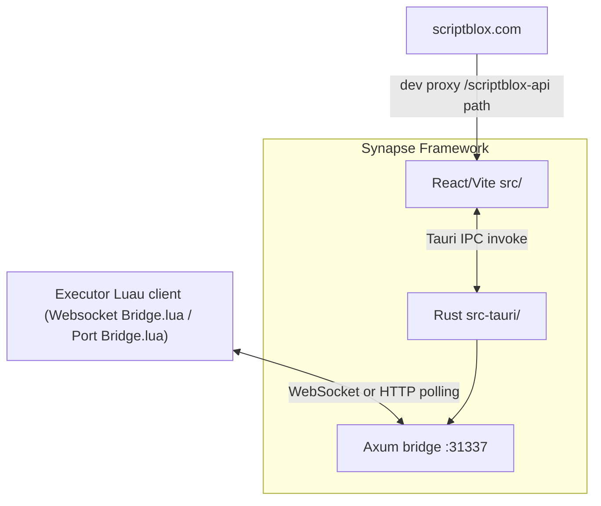

# Synapse Framework — Project Overview

Reference map for contributors and agents working in this repository. For executor integration details, see [WEBSOCKET_BRIDGE.md](./WEBSOCKET_BRIDGE.md).

## What this project is

**Synapse Framework** is a **Windows-focused Tauri 2 desktop app** that recreates and extends classic Synapse executor UIs. It provides:

- A **Luau script editor** (Monaco)
- **Script Hub** (ScriptBlox catalog + legacy embedded scripts)
- **Console** (F9 logs from executor)
- A **local executor bridge** with two switchable protocols (both served from the same Axum app on `127.0.0.1:31337`):
  - WebSocket bridge on `/ws` (client: `Websocket Bridge.lua`)
  - HTTP-polling **Port Bridge** under `/port_bridge/*` (client: `Port Bridge.lua`). Universally compatible — only requires `game:HttpGet` on the executor side.
- **Four UI shells** selectable via settings (`uiMode`)

This is **not** a web backend, monorepo, or authenticated SaaS. Persistence uses **localStorage**, **IndexedDB**, and **Tauri filesystem JSON** — there is no SQL/ORM.



## Repository layout

| Path | Role |
|------|------|
| `src/` | Production frontend — React 18, React Router 7, Monaco, Tailwind 4 |
| `src-tauri/` | Native shell — Tauri 2, IPC commands, Axum bridge |
| `dist/` | Vite build output → Tauri `frontendDist` |
| `public/` | Static Lua samples, fonts |
| `scripts/` | Dev helpers (`run-vite.mjs`, port cleanup, Monaco CSS gen) |
| `docs/` | Project and bridge documentation |
| `logo presets/` | Optional top-bar logo PNGs (runtime glob in `src/ui/topBarLogos.ts`) |

**Not in repo (as of this doc):** root `tsconfig.json`, ESLint/Prettier config, `.env` files, CI workflows, Docker, automated tests.

## Tech stack

| Layer | Stack |
|-------|-------|
| Frontend | TypeScript, React 18.3, Vite 6.3, React Router 7.13, Tailwind 4, Radix/shadcn UI, Motion, Zustand (minimal), Monaco + `luaparse` |
| Desktop | Tauri 2.10 (core invoke, dialog/fs plugins) |
| Backend | Rust 2021 — Axum 0.7 WebSocket server, Tokio, serde, winreg, arboard |
| Package mgr | npm (`package-lock.json`) |
| Ship target | Windows **MSI** via WiX (`src-tauri/wix/main.wxs`) |

## Entry points and boot flow

### Frontend bootstrap — `src/main.tsx`

1. Tauri detection → adds `synapse-tauri` class, sets window background from theme
2. Normalizes `/index.html` → `/` (Tauri asset protocol quirk)
3. **`applyAlternateShellBootPathFromSettings()`** — sync redirect to `/synapse-original/*`, `/synapse-x/*`, or `/synapse-v3/*` before React paints
4. Persists `app_settings_snapshot.json` via `persist_app_settings_snapshot` for **Rust cold-start routing**
5. Global contextmenu suppression (except Monaco, Radix menus)
6. Renders `src/app/App.tsx`

### Routing — `src/app/routes.tsx`

| Route prefix | Shell | Pages |
|--------------|-------|-------|
| `/` | Default “Synapse Blue” | editor, script-hub, console, settings, themes, integrated-webpage |
| `/synapse-original/*` | Synapse 2017 | loading, main, script-hub, settings, console |
| `/synapse-x/*` | Synapse X (UI replica) | same |
| `/synapse-v3/main` | Synapse V3 | main (editor-focused) |
| `/dialog/*` | Small confirmation webviews | clear tab, close all, etc. |

`altShellBootRedirectLoader` catches edge cases where persisted `uiMode` does not match the URL.

### Rust bootstrap — `src-tauri/src/main.rs` → `lib.rs`

- Reads `app_settings_snapshot.json` **before webview paint** to open the correct initial window route
- Spawns the Axum server on **`127.0.0.1:31337`** which serves both bridges — `/ws` for the WebSocket Bridge and `/port_bridge/*` for the HTTP-polling Port Bridge — plus a tiny watchdog that flips `port_connected` to false when the polling client stops checking in
- Registers all Tauri IPC commands

### Tauri IPC commands

| Command | Purpose |
|---------|---------|
| `persist_app_settings_snapshot` | Cold-start routing snapshot |
| `persist_window_icon_preset` | Taskbar icon preset |
| `read_text_file_abs` / `write_text_file_abs` | Absolute-path file I/O |
| `reveal_in_file_manager` / `open_scripts_folder` | Explorer integration |
| `list_sidebar_scripts` | List `.lua` in scripts dir |
| `open_external_url` | Browser (`http(s)` / `file://` only) |
| `write_clipboard_text` | Clipboard |
| `bridge_status` / `bridge_send_execute` | Executor attach + run script |
| `is_v3_enabled` | Reads `v3.ini` beside exe (frontend `useV3Enabled` always returns true) |

## UI shells and settings

**Settings:** `src/app/appSettings.ts`

- Storage key: `synapse.appSettings.v1`
- **`uiMode`:** `"default"` | `"synapseOriginal"` | `"synapseX"` | `"synapseV3"`
- **`bridgeMethod`:** `"websocket"` | `"port"` — which executor transport the UI uses (see [WEBSOCKET_BRIDGE.md](./WEBSOCKET_BRIDGE.md))
- Other flags: autoAttach, confirmations, resizable window, alwaysOnTop, minimap, error logging, edge curves per shell, integrated webpage URL

| Shell | Directory | Notes |
|-------|-----------|-------|
| Default | `src/app/pages/`, `MainLayout.tsx` | Primary 290×355-style UI; full executor bridge |
| Synapse Original (2017) | `src/app/synapse-original/` | Multi-window via Tauri `windowOps.ts` |
| Synapse X | `src/app/synapse-x/` | WPF-parity sizing; **no auth/executor wiring** (UI reproduction) |
| Synapse V3 | `src/app/synapse-v3/` | Newer theme; Zustand `v3Theme.ts`; many dormant Figma components |

**Theming:** `src/ui/shellTheme.ts` — CSS vars, IndexedDB media (`synapse-original-shell-media`), per-shell keys.

## Core feature modules

### Editor

- `src/editor/ScriptMonacoEditor.tsx` — Monaco mount
- `src/editor/luauLanguage.ts` — language registration
- `src/editor/synapseIntellisense.ts` — completions
- `src/editor/synapseDiagnostics.ts` — `luaparse` markers
- Tab/workspace: `src/app/editorWorkspace/` (`EditorWorkspaceContext`)
- Disk I/O: `src/app/scripts/editorDiskScripts.ts`

### Executor bridge

Both transports share **one** Axum listener on `127.0.0.1:31337`. Settings → **Bridge method** picks which path Execute and attach status use.

| Piece | Role |
|-------|------|
| `src-tauri/src/bridge.rs` | WebSocket `/ws`, script downloads, `bridge_send_execute` dispatch, legacy Matcha HTTP compat routes on `/matcha/*` (WebSocket method only) |
| `src-tauri/src/port_bridge.rs` | HTTP Port Bridge `/port_bridge/{hello,next,result,log}` (GET + POST), 12s long-poll on `next`, 20s liveness watchdog |
| `Websocket Bridge.lua` | Persistent socket, 3s reconnect, OnTeleport close, `?t=` URL cache-bust, optional `queue_on_teleport` bootstrap |
| `Port Bridge.lua` | HttpGet-first polling, POST when `request` exists, same execute/log protocol |
| `ExecutorBridgeContext.tsx` | `bridgeMethod` from `appSettings`, `invoke("bridge_send_execute", { source, method })` |
| Tauri events | `synapse:bridge-status` (`port_*` + WebSocket fields), `synapse:bridge-execute-result`, `synapse:bridge-log` |

Full protocol and endpoint tables: [WEBSOCKET_BRIDGE.md](./WEBSOCKET_BRIDGE.md).

### Script Hub

- `src/app/scriptHub/scriptBloxApi.ts` — ScriptBlox fetch layer (dev proxied in `vite.config.ts` as `/scriptblox-api`)
- `src/app/scriptHub/synapseLegacyScripts.ts` — embedded legacy URLs

### Integrated webpage

- `src/app/integratedSiteWebview.ts` — secondary native webview (bypasses iframe limits)

## Data persistence

| Store | Key / file | Used for |
|-------|------------|----------|
| localStorage | `synapse.appSettings.v1`, theme keys, editor tabs | Settings, themes, tabs |
| IndexedDB | `synapse-original-shell-media` | Background images/videos |
| Tauri config dir | `app_settings_snapshot.json`, `window_icon_preset.json`, `scripts/` | Cold boot, icons, sidebar scripts |
| Filesystem | User-picked paths via dialog plugin | Open/save scripts |

## Dev and build commands

```powershell
npm install
npm run dev          # Vite @ http://127.0.0.1:5173 (browser only)
npm run tauri:dev    # Full desktop (needs VS DevCmd on Windows)
npm run build        # vite build → dist/
npm run tauri:build  # MSI installer
```

- Port cleanup: `scripts/ensure-dev-port.mjs` (5173/4173)
- Tauri auto-runs `npm run dev` / `npm run build` via `src-tauri/tauri.conf.json` hooks

## Key files quick reference

| Concern | File |
|---------|------|
| Frontend entry | `src/main.tsx` |
| App root | `src/app/App.tsx` |
| Routes | `src/app/routes.tsx` |
| Settings | `src/app/appSettings.ts` |
| Editor page | `src/app/pages/EditorPage.tsx` |
| Bridge UI | `src/app/executorBridge/ExecutorBridgeContext.tsx` |
| Rust app | `src-tauri/src/lib.rs` |
| Bridge server | `src-tauri/src/bridge.rs` |
| Vite config | `vite.config.ts` |

## Working on this codebase

1. Identify which **UI shell** and **route** are affected
2. Decide whether logic belongs in **React**, **Tauri IPC**, or **`bridge.rs`**
3. Respect **boot-path synchronization** between `main.tsx`, `routes.tsx`, and Rust `boot_window_config`
4. Use [WEBSOCKET_BRIDGE.md](./WEBSOCKET_BRIDGE.md) as the protocol source of truth for executor integration

## Gaps and conventions

- **No automated tests** in the main app
- **No CI/CD** — builds are local MSI only
- **No root tsconfig** — Vite transpiles TS without strict project config
- **Figma heritage** — `src/imports/` SVG path modules; npm package name `@figma/my-make-file`
- **Auth:** none; Synapse X shell is explicitly UI-only
- **Synapse V3** is partially integrated (single main route; many dormant components)

## Optional future improvements

Not required for day-to-day development; add when explicitly requested:

- Root `tsconfig.json` for stricter TypeScript checking
- Vitest or similar test runner
- GitHub Actions CI for `npm run build` and `cargo test`
