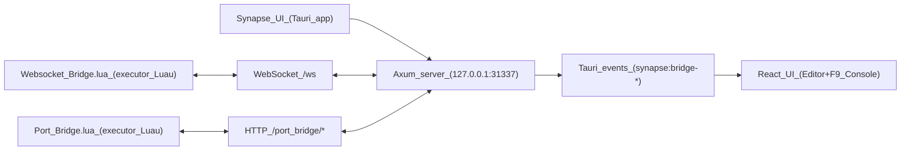

# Executor Bridges (Synapse UI)

This document describes the **executor bridges** that connect Synapse UI (desktop) to an executor-side Luau environment. Two transports are supported, switchable from **Bridge method** in Settings (Synapse Blue, Synapse 2017 Options, Synapse X Options, and V3 Settings → Application):

| Setting value | Transport | Executor client | When to use |
|---------------|-----------|-----------------|-------------|
| **WebSocket Bridge** (`websocket`) | `ws://127.0.0.1:31337/ws` | `Websocket Bridge.lua` | Executors with a working `websocket.connect` (or equivalent). Lowest latency; one persistent socket. |
| **Port Bridge** (`port`) | `http://127.0.0.1:31337/port_bridge/*` | `Port Bridge.lua` | Executors with **only** `game:HttpGet` (HTTP long-poll + GET fallbacks). Same message shapes, different framing. |

Both speak the **same JSON message shapes** (`hello`, `execute`, `execute_result`, `log`). Only the wire format differs. Both handlers run on the **same** Axum server on port `31337`; the dropdown only changes which transport the UI treats as “connected” and which queue receives Execute payloads.

Stored in `synapse.appSettings.v1` as `bridgeMethod`: `"websocket"` | `"port"` (see `src/app/appSettings.ts`).

This page covers:

- Network endpoints exposed by the desktop app.
- The JSON message protocol (shared by both transports).
- Reference `Websocket Bridge.lua` and `Port Bridge.lua` (executor-side), including reconnect and teleport behavior.
- Desktop implementation (Rust + Tauri events) and React wiring.
- How to adapt the same message shapes over a custom transport when WebSocket is unavailable.

## What the bridge is (high level)

Synapse UI runs a single Axum HTTP server on loopback that hosts both transports. Your executor runs a small Lua client (`Websocket Bridge.lua` or `Port Bridge.lua`) which:

- Opens a WebSocket connection to Synapse UI.
- Identifies itself with a `hello` message.
- Receives `execute` messages containing scripts (base64 encoded).
- Executes those scripts locally.
- Reports results back (`execute_result`).
- Streams console output back to the UI (`log`) by forwarding `print`/`warn` calls.



## Source of truth (files)

- Rust WebSocket bridge server: `h:\project\src-tauri\src\bridge.rs`
- Rust HTTP-polling Port Bridge: `h:\project\src-tauri\src\port_bridge.rs` (mounts `/port_bridge/*` on the same Axum app)
- Tauri commands/wiring: `h:\project\src-tauri\src\lib.rs`
- Reference executor clients: `h:\project\src-tauri\resources\scripts\Websocket Bridge.lua` and `h:\project\src-tauri\resources\scripts\Port Bridge.lua`
- UI bridge context: `h:\project\src\app\executorBridge\ExecutorBridgeContext.tsx`
- Execute button: `h:\project\src\app\pages\EditorPage.tsx`
- F9 console: `h:\project\src\app\pages\ConsolePage.tsx`

## Network surface

The desktop app listens on loopback only:

- **Host**: `127.0.0.1`
- **Port**: `31337` (Rust constant `BRIDGE_PORT`)

Endpoints:

- `GET /health` → returns `ok` (simple liveness check).
- `GET /ws` → WebSocket upgrade endpoint used by `Websocket Bridge.lua`.
- `GET /websocket_bridge.lua` → serves the Websocket Bridge Luau client.
- `GET /port_bridge.lua` → serves the Port Bridge Luau client.
- `GET /bridge.lua` → back-compat alias for `/websocket_bridge.lua` (kept so older executor configs keep working).

The reference WebSocket client connects to:

- `ws://127.0.0.1:31337/ws`

The Port Bridge speaks plain HTTP on the **same** port under `/port_bridge/*` (see the Port Bridge section below).

## WebSocket message protocol (JSON text frames)

All messages are JSON objects with a string `type` field.

### Executor → desktop (incoming messages)

These are parsed by the desktop WebSocket server (`IncomingWs` in `bridge.rs`).

#### 1) `hello`

Sent by the executor client after connecting, to populate status info in the UI.

```json
{
  "type": "hello",
  "client": "websocket-bridge",
  "version": 1
}
```

> The bundled WebSocket client identifies itself as `"websocket-bridge"` and the Port Bridge client as `"port-bridge"`. The exact value is informational — the server stores it in `BridgeStatus.client` (or `BridgeStatus.port_client` for the Port Bridge) but otherwise treats every hello as valid.

Effect on the desktop side:

- Updates the stored client identity (`BridgeStatus.client`).
- Triggers a `synapse:bridge-status` event to the UI.

#### 2) `execute_result`

Sent by the executor client to acknowledge a script execution request.

Success:

```json
{
  "type": "execute_result",
  "id": "exec_...",
  "ok": true
}
```

Failure:

```json
{
  "type": "execute_result",
  "id": "exec_...",
  "ok": false,
  "error": "error message here"
}
```

Notes:

- `id` must match the `id` from the `execute` request.
- `error` is optional in the Rust type; send it when you have a useful message.

Effect on the desktop side:

- The desktop emits `synapse:bridge-execute-result` with the same fields.
- The UI uses the `id` to resolve a pending execution promise.

#### 3) `log`

Sent by the executor client to stream console output into Synapse UI’s F9 console.

```json
{
  "type": "log",
  "level": "info",
  "message": "hello from print()"
}
```

Notes:

- `level` is treated as a string on the Rust side.
- The UI normalizes it into one of: `info`, `warn`, `error`. Any other value becomes `info`.
- `message` is displayed as-is by the UI.

Effect on the desktop side:

- The desktop emits `synapse:bridge-log` to the UI with `{ level, message }`.

#### Unknown message types

Any message not matching the known shapes is ignored by the desktop (`IncomingWs::Unknown`).

### Desktop → executor (outgoing messages)

These are sent by the desktop when you click Execute in the UI.

#### 1) `execute`

```json
{
  "type": "execute",
  "id": "exec_...",
  "source_b64": "Zm9vKCk=",
  "encoding": "base64",
  "origin": "editor"
}
```

Field meanings:

- `id`: Unique execution id. The executor must echo this in `execute_result`.
- `source_b64`: Script source as UTF-8 bytes, base64 encoded.
- `encoding`: Currently always `"base64"`.
- `origin`: Currently `"editor"` (useful if you later add other sources).

Execution contract:

- The executor must decode `source_b64` according to `encoding`.
- It must run the script in the Luau environment.
- It should reply with an `execute_result` for the same `id` regardless of success/failure.

#### 2) `ping` (reserved)

The Rust code defines a `ping` variant, but the current server implementation does not send it. Consider it reserved for future keep-alives.

## Reference executor client: `Websocket Bridge.lua`

The reference client is intentionally small and adapter-based because executors expose different globals for networking and compilation.

### Lifecycle and resilience

On start:

1. Waits for `game:IsLoaded()` (when `game` exists) before any networking, to avoid bricking the executor thread during load.
2. Calls any previous `getgenv().SynapseBridgeStop()` so re-running the script does not leave duplicate sockets.
3. Registers `getgenv().SynapseBridgeStop` to close the active socket and stop the reconnect loop.

Connection loop:

- Connects to `ws://127.0.0.1:31337/ws` with a random `?t=<tick>` query parameter to bypass executor-side singleton URL checks for orphaned sockets.
- On failure: prints a retry message and waits **3 seconds** (`RETRY_INTERVAL`) before trying again.
- On disconnect: clears `activeWs`, prints that it will reconnect, waits **3 seconds**, then reconnects.
- **OnTeleport**: hooks `Players.LocalPlayer.OnTeleport` (when available) and closes the socket before teleport so the next session does not hit “already connected” ghost state.
- **Teleport persistence**: when `queue_on_teleport` exists, queues a snippet that waits for load, fetches `http://127.0.0.1:31337/websocket_bridge.lua`, and runs it in the new place.

Download URLs for the bundled client:

- `GET http://127.0.0.1:31337/websocket_bridge.lua` (canonical)
- `GET http://127.0.0.1:31337/bridge.lua` (alias for older configs)

### WebSocket connect adapter

The client tries, in order:

- `websocket.connect(url)`
- `syn.websocket.connect(url)`
- `WebSocket.connect(url)`

If none exist, it errors with a message that no `websocket.connect` was found in this executor.

### Executing source code

To run scripts, it uses Luau/Lua’s compiler on **plain source text**:

1. **`load(src, "@synapse_bridge", "t")` when `load` exists** — the `"t"` mode means **text chunk only**. On Luau (e.g. Roblox), calling `load(src)` without `"t"` can probe bytecode first; bogus bytes then surface as **`bytecode corrupted`**. Prefer `"t"` first, then fall back to two-argument `load(src, chunkname)` if the runtime rejects three arguments.
2. **`loadstring(src, chunkname)`** only if `load` is unavailable.

If neither exists, it raises:

> `No load/loadstring available in this executor.`

### Minimal JSON (why it exists)

`Websocket Bridge.lua` includes a tiny JSON encoder/field extractor so it can run without depending on executor-provided JSON libraries. It is designed specifically for the bridge’s narrow message shapes.

When **`game`** exists (Roblox), incoming WebSocket messages are parsed with **`HttpService:JSONDecode`** first so long `source_b64` strings and escaping stay reliable. Otherwise it falls back to a tiny regex extractor for `"type"`, `"id"`, `"source_b64"`, and `"encoding"` only.

Important limitations:

- The fallback encoder/parser is not general-purpose JSON — only the bridge message shapes.
- Base64 decode tries `syn.crypt.base64`, `crypt.base64`, then `base64` helpers before failing.

### Startup sequence

On start:

1. Connects to `ws://127.0.0.1:31337/ws`.
2. Prints a local confirmation: `"[bridge] connected:"`.
3. Sends a `hello` message:

```json
{"type":"hello","client":"websocket-bridge","version":1}
```

### Forwarding output into the UI console

The reference client wraps `print` and `warn`:

- Builds a single string by `tostring()`-ing each argument and joining with a space.
- Sends a `log` message with level `info` for `print`, `warn` for `warn`.
- Calls the original `print`/`warn` afterward, so in-game output remains unchanged.

This gives you a best-effort mirror of what your scripts are emitting.

### Handling execute requests

When a WebSocket message arrives:

1. Extract `type`.
2. If it is not `execute`, ignore it.
3. Read `id`, `source_b64`, `encoding`.
4. Base64-decode `source_b64` (see base64 helpers above).
5. Execute with `pcall`.
6. Reply with `execute_result`:
   - `ok: true` on success
   - `ok: false` and `error: "<pcall error>"` on failure

### Disconnect handling

On close, it prints `"[bridge] disconnected"`.

## Desktop implementation (Rust + Tauri)

The desktop bridge is implemented in `h:\project\src-tauri\src\bridge.rs` and exposed to the UI through Tauri events and commands.

### Server startup

In `h:\project\src-tauri\src\lib.rs`, the app creates a `BridgeState` and spawns the server task during `.setup()`:

- The server binds to `127.0.0.1:31337`.
- If binding/serving fails, the error is stored and pushed to the UI via status events.

### Single active WebSocket connection model

The WebSocket bridge keeps one active socket at a time:

- `active_tx`: channel used to push `execute` JSON frames to the connected client.
- `connected`: whether a WebSocket client is attached.
- `client`: last `hello` payload (`client` + `version`).

When the socket disconnects, `connected` and `active_tx` are cleared, `client` is cleared, and a new `synapse:bridge-status` event is emitted. The Lua client is responsible for reconnecting (see retry loop above).

### Method-aware execute dispatch

`bridge_send_execute` accepts optional `method` (`"websocket"` default, or `"port"`):

- **`websocket`**: requires `connected`; sends an `execute` frame on the active WebSocket (or queues for legacy Matcha HTTP compat on the same server — still counted as WebSocket method in the UI).
- **`port`**: requires `port_connected`; pushes onto `port_pending_execs` and wakes any blocked `/port_bridge/next` long-poll via `port_notify`.

The React provider passes `method: bridgeMethod` from settings on every Execute (see `ExecutorBridgeContext.tsx`).

### Tauri events emitted to the UI

The bridge emits three events that the React UI listens to:

- `synapse:bridge-status`
- `synapse:bridge-execute-result`
- `synapse:bridge-log`

Payloads:

- `synapse:bridge-status`: the `BridgeStatus` object with `connected`, `client`, and `last_error` fields.
- `synapse:bridge-execute-result`: `{ id, ok, error }`
- `synapse:bridge-log`: `{ level, message }`

### Tauri commands used by the UI

The UI uses these commands (defined in `lib.rs`):

- `bridge_status`: returns the current `BridgeStatus`.
- `bridge_send_execute`: sends an `execute` message to the connected client and returns the generated `id` (`exec_<uuid>`).

## UI implementation (React)

The UI side is split into two parts:

1) A context/provider that owns bridge state and log collection.  
2) Pages/components that call into it (Editor, F9 Console, Attach flow).

### Bridge context: `ExecutorBridgeContext.tsx`

`h:\project\src\app\executorBridge\ExecutorBridgeContext.tsx` is the bridge client inside the UI:

- Reads `bridgeMethod` from `readAppSettings()` and refreshes when settings change (`APP_SETTINGS_CHANGED_EVENT` / `storage`).
- On mount, fetches initial status via `invoke("bridge_status")`.
- Subscribes to the three Tauri events:
  - `synapse:bridge-status` → updates `status`; `connected` is derived from `bridgeMethod`:
    - **port** → `status.port_connected`
    - **websocket** → `status.connected` (and legacy Matcha flag when present)
  - `synapse:bridge-execute-result` → resolves pending executions by `id`
  - `synapse:bridge-log` → appends log entries to `logs` (keeps last ~800)

It provides:

- `execute(source)`:
  - Enforces attach gating (you must click Attach, wait for animation, and be connected).
  - Calls `invoke("bridge_send_execute", { source })`.
  - Waits up to 2.5s for an `execute_result`; if none arrives, it treats the send as success (some clients may not ack).

- `logs` and `clearLogs()`:
  - `logs` is just an in-memory array of `{ ts, level, message }`.
  - `level` is normalized so only `warn` and `error` get special styling; everything else is `info`.

### Execute button: `EditorPage.tsx`

In `h:\project\src\app\pages\EditorPage.tsx`, the Execute button calls:

- `bridge.execute(activeTab.content)`

If `execute()` returns an error (not attached / not connected / empty script), the UI shows an alert with the message.

### F9 console: `ConsolePage.tsx`

`h:\project\src\app\pages\ConsolePage.tsx` renders:

- A header (“F9 Console”).
- A Copy button which copies `logs.map(l => l.message).join("\n")`.
- A Clear button (`clearLogs`).
- A scrollable output area that maps `logs` to list items:
  - `warn` level: yellow-ish color
  - `error` level: red-ish color
  - otherwise: theme text color

This is a direct view of the `synapse:bridge-log` event stream.

### Attach gating (why it matters for WebSocket)

The UI intentionally gates execution behind an attach click and an attach animation “arm” state. Conceptually:

- The WebSocket may be connected, but the UI won’t allow scripts to be sent until the user has performed Attach (and the animation completes).
- This prevents accidental execution or replaying attach animations.

## Troubleshooting

### “Bridge not connected”

This means the UI does not see an active bridge connection. For the WebSocket method, the fix is:

- Ensure the desktop UI is running.
- Run `Websocket Bridge.lua` in the executor so it connects to `ws://127.0.0.1:31337/ws` (or `Port Bridge.lua` if the dropdown is on **Port**).

### “Port already in use” / bind failure

The desktop bridge binds `127.0.0.1:31337`. If another process is using that port, the bridge server will fail to start. Stop the conflicting process or change the port in code (requires rebuilding).

### No logs in F9 console

The F9 console only shows what the executor client sends as `log` messages. If your scripts print but nothing appears:

- Confirm your `Websocket Bridge.lua` (or `Port Bridge.lua`) wrapper for `print`/`warn` is active.
- Confirm your executor’s WebSocket object supports `.Send` and the `.OnMessage` / `.OnClose` events used by the script.

## Adapting to “externals” with a Luau environment (no WebSocket)

Some environments can run Luau but cannot open a raw WebSocket client from within the Luau runtime. In that case:

- Treat the **JSON message shapes** in this document as the compatibility contract.
- Implement the same logical flow over any transport you do have (HTTP polling, named pipes, file-based IPC, a host process that can do networking, etc.).

Minimum compatibility behavior:

1) The external must receive an **execute request** with:

- `id`
- `source_b64`
- `encoding` (use `"base64"`)
- `origin` (optional; `"editor"` is fine)

2) The external must run the script (after base64 decode) in its Luau environment.

3) The external must respond with:

- `execute_result` with the same `id` and `{ ok, error? }`

4) The external should stream output by emitting:

- `log` messages with `{ level, message }`

If you keep those fields identical, the desktop-side can remain a simple “transport adapter” that forwards them into the existing `synapse:bridge-*` event pipeline used by the UI.

---

## Port Bridge (HTTP polling, `127.0.0.1:31337/port_bridge/*`)

The Port Bridge is an alternative transport for executors that cannot open a WebSocket from Luau — only loopback HTTP (typically `game:HttpGet`). It runs on the **same** Axum server as the WebSocket bridge. Set **Bridge method** to **Port Bridge** in Settings, run `Port Bridge.lua` in the executor (or fetch it from `GET /port_bridge.lua`), then Attach in the UI the same way as WebSocket.

### Reference executor client: `Port Bridge.lua`

Behavior mirrors the WebSocket client where it matters:

- Waits for `game:IsLoaded()` before networking.
- Stops any previous instance via `getgenv().SynapsePortBridgeStop`.
- Registers `SynapsePortBridgeStop` to end the poll loop.
- Main loop: `GET /port_bridge/hello`, then repeated long-poll `GET /port_bridge/next`.
- On poll error: waits **3 seconds** (`ERROR_BACKOFF`) before retrying; short **0.5 s** backoff (`POLL_BACKOFF`) between successful polls when `exec` was null.
- Uses `load(..., "t")` first for execute payloads (same Luau text-chunk rationale as WebSocket).
- Wraps `print` / `warn` → `log` events for the F9 console.
- **Teleport persistence**: `queue_on_teleport` snippet fetches `http://127.0.0.1:31337/port_bridge.lua` after load.

Download: `GET http://127.0.0.1:31337/port_bridge.lua`

### Server

- **Host / Port**: `127.0.0.1:31337` (same port as the WebSocket bridge)
- **Mount point**: `/port_bridge/*` (routes registered in `src-tauri/src/port_bridge.rs`)
- **Transport**: plain HTTP. Every endpoint accepts either POST (JSON body) or GET (query string) so executors that only have `game:HttpGet` still work.

### Endpoints

| Method | Path | Purpose |
|--------|------|---------|
| `POST` / `GET` | `/port_bridge/hello` | Client identification. Sets `port_connected=true` and stores `port_client = { client, version }`. |
| `GET` | `/port_bridge/next` | Long-poll for the next execute request. Holds the response open for up to ~12s; returns `{"exec": {...}}` as soon as one is queued, or `{"exec": null}` on timeout. |
| `POST` / `GET` | `/port_bridge/result` | Return an `execute_result`. GET form accepts `id`, `ok`, `error_b64` query params. |
| `POST` / `GET` | `/port_bridge/log` | Stream a single log line. GET form accepts `level` and `message_b64`. |

All four routes refresh `port_last_seen`. A watchdog in `port_bridge.rs` ticks every **3 s** and sets `port_connected = false` after **20 s** without any `/port_bridge/*` traffic, so the UI attach state matches reality even if the executor crashes without a goodbye.

### Message shapes

Identical to the WebSocket protocol — `hello`, `execute_result`, `log` (client → server) and `execute` (server → client, embedded inside the `next` response as `{"exec": {...}}`). Only the framing differs.

The bundled `Port Bridge.lua` client identifies itself as `"client":"port-bridge"`.

### Static routes (Lua client downloads)

- `GET /port_bridge.lua` → the canonical URL for fetching the Port Bridge Luau client (served from `resources/scripts/Port Bridge.lua`).
- `GET /websocket_bridge.lua` → the canonical URL for the WebSocket client.
- `GET /bridge.lua` → back-compat alias for `/websocket_bridge.lua`.

### Status events

`BridgeStatus` (emitted via `synapse:bridge-status`) carries three extra fields:

- `port_listening` — true once the Port Bridge routes are mounted.
- `port_connected` — true while the polling client has touched `/port_bridge/*` within the last 20s.
- `port_client` — `{ client, version }` from the most recent hello.

Execute results and logs always use the same Tauri events (`synapse:bridge-execute-result`, `synapse:bridge-log`) regardless of transport — only the attach/connected gating and the Rust dispatch path differ.

### Why HTTP polling for limited executors

Many sandboxed executors only expose `game:HttpGet` against loopback — no WebSocket, no TCP from script, and sometimes no `request()`. The Port Bridge is built for that floor:

1. **Long-polling `GET /port_bridge/next`** (up to **12 s** per request) holds the connection open so an Execute in the UI wakes the poll immediately via `port_notify` — no busy-spin loop on the executor.
2. **Every mutating route has a GET form** with base64 query fields (`error_b64`, `message_b64`, hello as query params) so `HttpGet`-only runtimes can still post results and logs.
3. **`Port Bridge.lua` prefers POST** via `request` / `syn.request` / `http_request` when present, and transparently falls back to GET forms.

### HTTP adapter summary (`Port Bridge.lua`)

| Need | First choice | Fallback |
|------|--------------|----------|
| Read JSON (`/next` body) | `HttpService:JSONDecode` | Tiny field extractor |
| POST JSON (hello / result / log) | `request` with `Method = "POST"` | GET + base64 query params |
| GET (`/next`, GET fallbacks) | `game:HttpGet` | `request` with `Method = "GET"` |
| Base64 | `syn.crypt.base64` / `crypt.base64` / `base64` | Pure-Lua encoder in the file |
| Run received source | `load(..., "t")` then two-arg `load` | `loadstring` |

